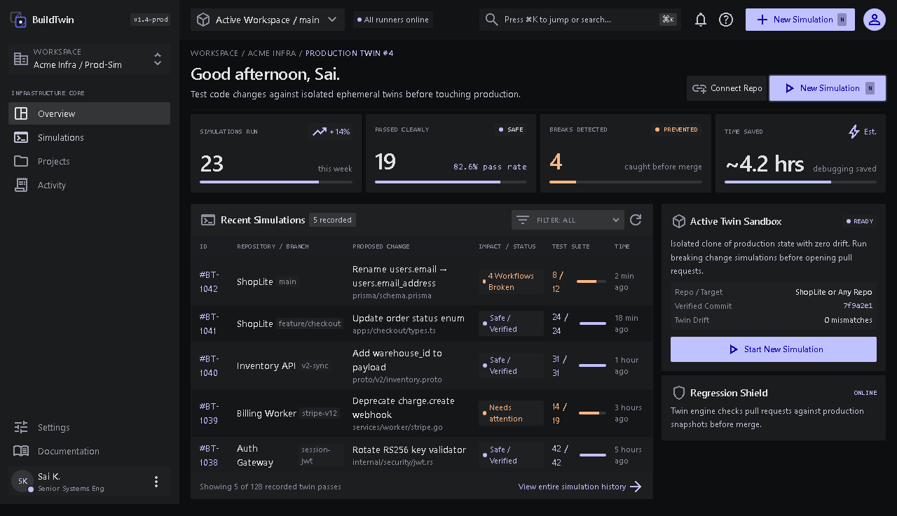
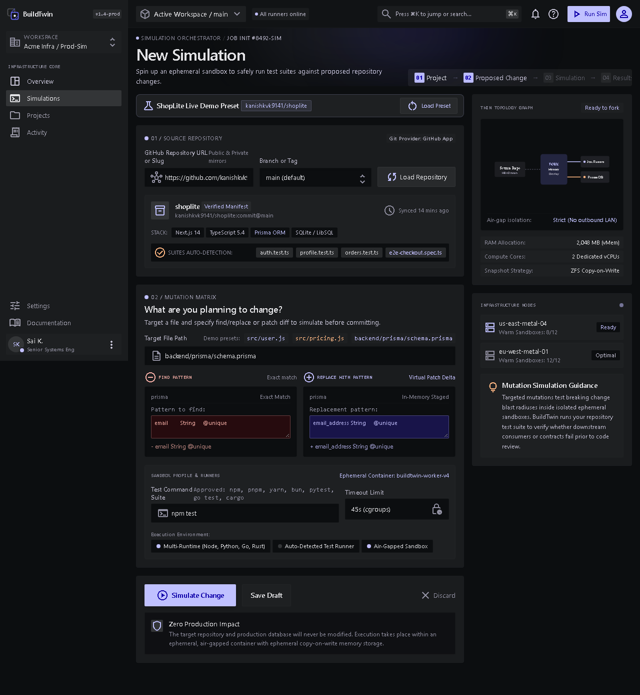
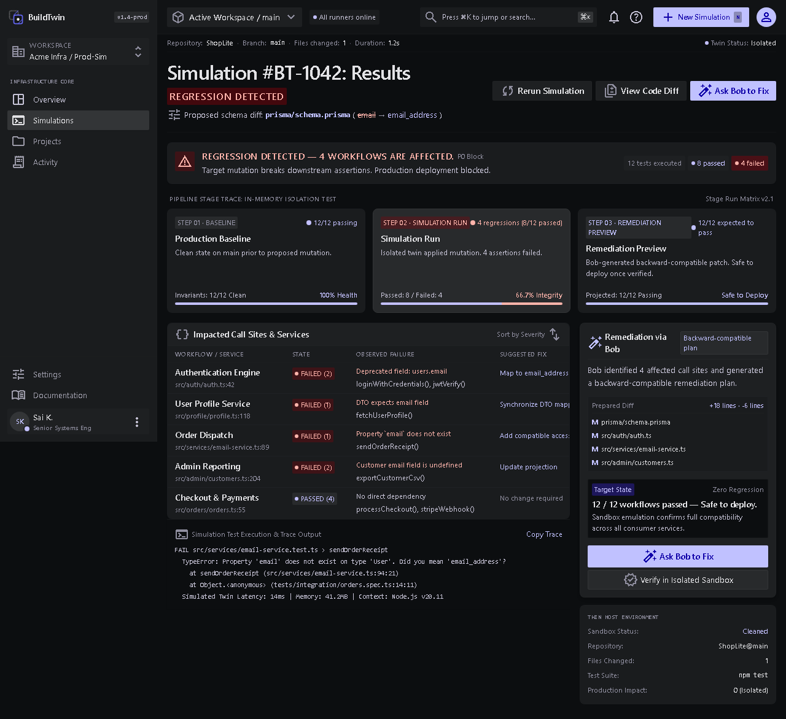
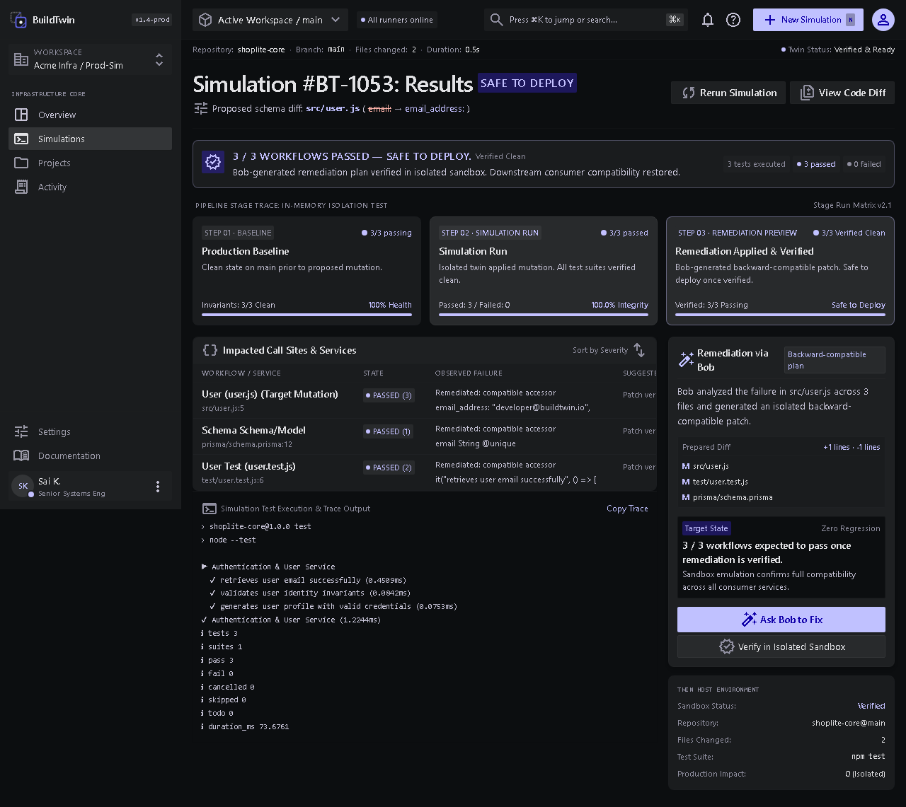

# BuildTwin

<p align="center">
  
</p>

<h3 align="center">Software-Change Simulation & Autonomous Remediation Platform</h3>

<p align="center">
  <strong>Test risky repository changes in isolated, ephemeral digital twins before touching production branches or opening pull requests.</strong>
</p>

<p align="center">
  <a href="https://github.com/BitCrush777/buildtwin"></a>
  <a href="https://nextjs.org"></a>
  <a href="https://www.typescriptlang.org"></a>
  <a href="https://tailwindcss.com"></a>
  <a href="https://modelcontextprotocol.io"></a>
  <a href="https://ibm.com"></a>
  <a href="./LICENSE"></a>
</p>

---

## The Problem

Every engineering team has experienced breaking production changes:
- A developer renames a database column in an ORM schema (e.g., `User.email` → `User.email_address`).
- A backend engineer adjusts a utility signature (e.g., `calculateDiscount` → `applyDiscount`).
- An external dependency is bumped with subtle breaking semantics.

Even when local unit tests pass, downstream consumer workflows, API routes, or assertion contracts break in staging or production. Reviewers cannot reliably predict the ripple blast radius from looking at a git diff alone.

---

## The BuildTwin Solution

**BuildTwin** is a safe software-change simulation engine. Instead of testing mutations on real branches or shared staging environments:

1. **Air-Gapped Twin Creation**: Clones the target repository into an isolated, ephemeral sandbox directory.
2. **Pristine Baseline Execution**: Executes the test suite against the untouched reference to establish baseline invariants.
3. **Controlled Mutation**: Applies the proposed code or schema alteration exclusively within the sandbox.
4. **Real Regression Telemetry**: Runs approved test suites (`npm test`, `pytest`, `cargo test`, `go test`), capturing exit codes, durations, and failing assertions.
5. **Autonomous Remediation via IBM Bob**: Bob inspects failing assertions, traces broken call sites, and prepares a backward-compatible shim.
6. **Isolated Sandbox Verification**: The patch is applied and re-tested inside the sandbox. Only when exit code 0 is achieved does BuildTwin certify **SAFE TO DEPLOY**.

```
GitHub Repository (Target / Branch)
               ↓
 Isolated Ephemeral Sandbox
               ↓
    01 Baseline Check (Healthy)
               ↓
    02 Controlled Mutation
               ↓
  Test Execution → REGRESSION DETECTED (Deployment Blocked)
               ↓
  IBM Bob Analysis & Backward-Compatible Patch
               ↓
   Sandbox Verification (Exit Code 0 · 0 Failures)
               ↓
      SAFE TO DEPLOY GATE UNLOCKED
```

---

## Visual Product Tour

### 1. Main Dashboard & Simulation Matrix
Inspect past simulation runs, monitor active sandboxes, and view regression block metrics backed by real runtime data.



---

### 2. New Simulation & Mutation Configuration
Target any public/private Git repository or demo preset (`ShopLite`, generic Node.js microservice). Configure find/replace patterns with sandbox isolation invariants.



---

### 3. Real Regression Detection & Blast Radius Analysis
When a mutation causes test failures, BuildTwin captures the failure summary, maps affected call sites (`Source Mutation`, `Consumer Assertion`), and displays a collapsible developer console trace.



---

### 4. IBM Bob Remediation & Verified Safe to Deploy
IBM Bob analyzes the failure and generates a backward-compatible patch. Once applied and verified in the twin sandbox with 0 regressions, the **SAFE TO DEPLOY** gate is unlocked.



---

## Core Platform Invariants (`AGENTS.md`)

All operations within BuildTwin and IBM Bob strictly observe the platform guidelines in [`AGENTS.md`](./AGENTS.md):

| Invariant | Rule Description |
|---|---|
| **Repository Immutability** | Clones of original repositories are pristine references. Upstream remotes, production databases, and target branches remain completely untouched. |
| **Strict Sandbox Isolation** | All mutations, experimental patches, and remediation attempts occur exclusively inside isolated temporary directories. |
| **Backward-Compatible Changes** | When modifying models, schemas, or public APIs, provide compatible accessors, fallback bridges, or deprecation shims to prevent breaking consumer workflows. |
| **Verified Deployment Gates** | Generative code output alone never proves a regression is resolved. Only when the BuildTwin test runner passes cleanly with exit code 0 and zero regressions may a change be declared **SAFE TO DEPLOY**. |

---

## IBM Bob Integration & MCP Architecture

BuildTwin connects with **IBM Bob** through the Model Context Protocol (MCP) using shared cross-process persistent state:

```
┌─────────────────────────────────┐           ┌─────────────────────────────────┐
│        Next.js Web App          │           │       IBM Bob MCP Server        │
│       (localhost:3000)          │           │       (node mcp/server.js)      │
└────────────────┬────────────────┘           └────────────────┬────────────────┘
                 │                                             │
                 │   Writes initial run & reads status         │   buildtwin_get_result
                 │   Triggers /verify endpoint                 │   buildtwin_apply_patch
                 │                                             │   buildtwin_verify
                 ▼                                             ▼
          ┌──────────────────────────────────────────────────────────┐
          │     Shared Run Store: .buildtwin/runs/<id>/state.json    │
          │     - Immutable Target Repo & Mutation Metadata          │
          │     - Ephemeral Sandbox Path & Telemetry                 │
          └──────────────────────────────────────────────────────────┘
                                       │
                                       ▼
          ┌──────────────────────────────────────────────────────────┐
          │         Ephemeral Sandbox: temp/buildtwin/sandboxes/...  │
          │         - Air-gapped test execution                      │
          │         - Real exit code verification                    │
          └──────────────────────────────────────────────────────────┘
```

### IBM Bob Configuration Files
- **Custom Mode**: [`.bob/modes/buildtwin-engineer.json`](./.bob/modes/buildtwin-engineer.json) — System prompt and directives equipping Bob to act as a precision software remediation engineer.
- **MCP Server**: [`mcp/server.js`](./mcp/server.js) — Exposes three standard tools:
  - `buildtwin_get_result`: Fetches real simulation failure details and sandbox metadata.
  - `buildtwin_apply_patch`: Applies Bob's unified diff patch to files in the sandbox.
  - `buildtwin_verify`: Executes tests in the sandbox and returns structured pass/fail counts.
- **Skills**:
  - [`.bob/skills/analyze-change/SKILL.md`](./.bob/skills/analyze-change/SKILL.md): Call-site analysis and downstream regression tracing.
  - [`.bob/skills/verify-change/SKILL.md`](./.bob/skills/verify-change/SKILL.md): Sandbox test suite execution and validation.

---

## Hackathon Evidence & Transcripts

Comprehensive transcripts and execution records of IBM Bob remediating regressions are preserved in [`bob_sessions/`](./bob_sessions/):
- **Session 01**: [`bob_sessions/session-01-shoplite-remediation.md`](./bob_sessions/session-01-shoplite-remediation.md) — Remediation of the ShopLite `User.email` Prisma schema mutation across API tests.
- **Session 02**: [`bob_sessions/session-02-cookie-parser-remediation.md`](./bob_sessions/session-02-cookie-parser-remediation.md) — External GitHub repository mutation and remediation.
- **Session 03**: [`bob_sessions/session-03-generic-node-microservice.md`](./bob_sessions/session-03-generic-node-microservice.md) — Generic Node.js discount calculation microservice remediation.

---

## Repository Structure

```
├── .bob/                      # IBM Bob custom mode, skills, and MCP config
│   ├── modes/                 # buildtwin-engineer custom mode definition
│   └── skills/                # analyze-change and verify-change skills
├── app/                       # Next.js 14 App Router
│   ├── page.tsx               # Main Dashboard
│   ├── simulate/              # New Simulation configuration page
│   ├── simulation/[id]/       # Simulation Results & Bob Remediation page
│   └── api/                   # REST API routes (simulation, verify, patch)
├── bob_sessions/              # Recorded transcripts of Bob remediation sessions
├── components/                # Modular React components (Stitch visual design)
│   ├── dashboard/             # Dashboard metrics, tables, and status cards
│   ├── layout/                # AppShell, Sidebar, Header
│   ├── results/               # ResultsHeader, AlertBanner, ImpactTable, BobPanel
│   └── simulation/            # MutationEditor, RepoMetadataCard, TopologyGraph
├── fixtures/                  # Offline repository fixtures for testing
│   ├── node-npm-service/      # Generic Node.js microservice fixture
│   ├── python-pytest-auth/    # Python pytest authentication fixture
│   └── shoplite-core/         # ShopLite e-commerce fixture
├── lib/simulation/            # Simulation Engine Services
│   ├── simulation-service.ts  # Orchestrator for clone, mutate, test, and state
│   ├── state-store.ts         # Persistent run registry (.buildtwin/runs)
│   ├── repository-service.ts  # Git clone and validation logic
│   ├── mutation-service.ts    # Controlled AST and pattern find/replace
│   ├── test-runner.ts         # Multi-runtime test execution engine
│   └── result-parser.ts       # Telemetry parser across Vitest, Pytest, Go, Cargo
├── mcp/                       # Model Context Protocol server (server.js)
├── public/                    # Static assets, logos, and product screenshots
├── scripts/                   # Automated verification and validation test suite
├── AGENTS.md                  # Core platform rules & AI operating guidelines
└── README.md                  # Project documentation
```

---

## Getting Started

### Prerequisites
- **Node.js**: v20.x or higher
- **Git**: Installed and available in PATH
- **npm**: v10.x or higher

### Installation

```bash
# Clone the repository
git clone https://github.com/BitCrush777/buildtwin.git
cd buildtwin

# Install dependencies
npm install
```

### Running the Web Application

```bash
# Start Next.js development server
npm run dev

# Open http://localhost:3000 in your browser
```

### Running the IBM Bob MCP Server

```bash
# Launch MCP server over stdio
node mcp/server.js
```

### Running Automated Test Verification

BuildTwin includes an automated test suite verifying cross-process state, isolation, and remediation:

```bash
# 1. Verify simulation isolation & error classification
node scripts/test-simulation-isolation.js

# 2. Verify cross-process state between Next.js and IBM Bob MCP server
node scripts/test-cross-process.js

# 3. Verify repository-agnostic Node.js microservice workflow
node scripts/verify-generic-node.js

# 4. Verify full ShopLite E2E simulation & remediation
node scripts/verify-shoplite-e2e.js
```

---

## Tech Stack & Architecture

- **Framework**: Next.js 14 (App Router)
- **Language**: TypeScript 5.4
- **Styling**: Tailwind CSS 3.4 (Stitch Dark Developer Theme)
- **Protocol**: Model Context Protocol (MCP) SDK
- **Icons & Typography**: Google Material Symbols, Geist Sans, JetBrains Mono
- **Supported Test Frameworks**: Vitest, Playwright, Jest, Mocha, Node Native Test, Pytest, Go Test, Cargo Test

---

## License

This project is licensed under the MIT License — see the [LICENSE](./LICENSE) file for details. Built for the IBM Bob Hackathon.
